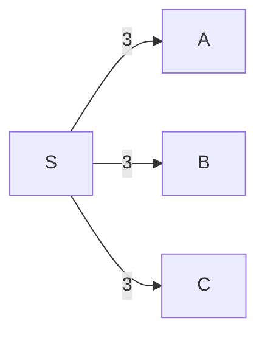

# Ford-Fulkerson Algorithm 

> Ford-Fulkerson Algorithm 줄여서 FFA는 네트워크 유량(network flow)의 최댓값을 구하는 알고리즘으로, 그리디 알고리즘에 속한다.

```mermaid
flowchart LR
    S[S] --> |3|A[A];
    S --> |3|B[B];
    S -->|3| C;
```

참고  
https://blog.naver.com/kks227/220804885235